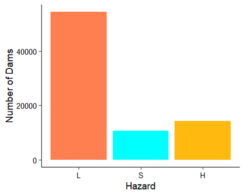
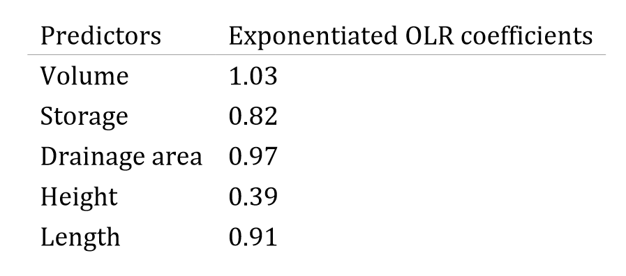
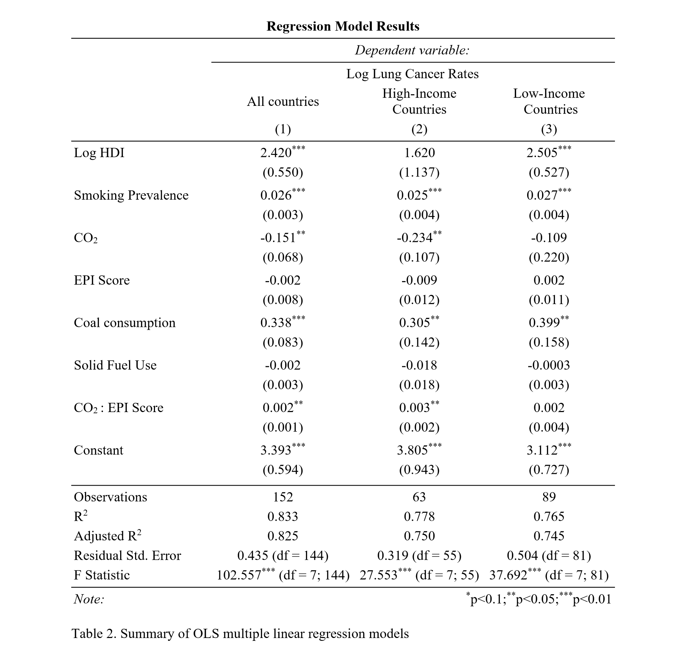

helooooooo2
## Project 1: Water Budget web application for the Internet of Water project (in progress)
#### Fullstack web development (R Shiny, Javascript, HTML, CSS, SPARQL) 
* Develop an interactive tool to visualize the relationship among different components, estimation methods, parameters and data sources of water budget framework across different states
* Query RDF databases of water budget frameworks across states using SPARQL (Structured Protocol and RDF Query Language) to feed data into the web app
* Wrangle nested JSON file obtained through SPARQL and curate reproducible D3 interactive trees in Javascript
* Integrate D3 visualizations by states, components and data sources based on user input into the web app using R Shiny and HTML
* Dynamically summarize flow information and inter-state relationship of each component and link each water budget term to its unique resource identifier via hyperlink
* Stylize the webapp using Javascript and CSS

## [Project 2: US Dam Safety & HUC-8 Runoff](https://github.com/PierreMishra/US_Dam_Safety_ENV.872)
#### Logistic regression & trend analysis (R)
* Explored physical features for 90,000 dams that can predict dam safety using National Inventory of Dams dataset by US Army Corps
* Performed ordinal logistic regression on logged predictor variables to determine the effects of the structure of a dam on its classified safety hazard
* Investigated the stream discharge trends in North Carolina (NC) to find whether increasing runoff trends pose a threat to dam structures
* Performed montonic trend analysis to determine the annaul run-off trends in hydrologic unit 8 (HUC-8) sub basins of NC using USGS Waterwatch dataset
* Layered the dams and run-off analysis as shapefiles within NC boundary to observe the spatial distribution of dams with varying risks, in sub basins with increasing or decreasing run-off trends.

  
  

## [Project 3: Analyzing US Safe Drinking Water Act Violations since 1988](https://github.com/PierreMishra/Safe_Drinking_Water_Act_Violations_ENV.665)
* Used Bayesian statisitics to study factors associated to SDWA violations and frequency of such violations in 50 states
* Performed logsitic regression using a logit link function to investigate the effects on acute health-based violations by public water system type, number of population served by the water system and the source of water supply
* Performed poisson regresson using a log link function to analyze the temporal effect on frequency of acute-health based violations across states.
* Mapped the results of poisson regression to compare SDWA violations among states with respect to time

<iframe width="100%" height="200%" frameborder="0" scrolling="no" src="//plotly.com/~prashankpm/1.embed"></iframe>

## [Project 4: Global Lung Cancer Rates](https://github.com/PierreMishra/Lung_Cancer_Rates_ENV.710)
* Explored environmental and socio-economic variables of 152 nations from 6 separate CSVs to analyze their effects on lung cancer rates.
* Implemented ordinary least square (OLS) method to estimate the parameters of multiple linear regression models.
* Developed three OLS models for all nations, high-income nations (with GDP per capita > $15,000) and low-income nations (with GDP per capita < $15,000)

  
  

## [Project 5: Electric Vehicle Sales Forecasting](https://github.com/PierreMishra/EV_Sales_Forecasting_ENV.790)
* Used time series forecasting to analyze national targets of electric vehicle sales of the major global EV players, mainly Japan
* Employed various forecasting models such as state-space models, ARIMA, exponential smoothing etc. to show their applicability to long-term predictions

