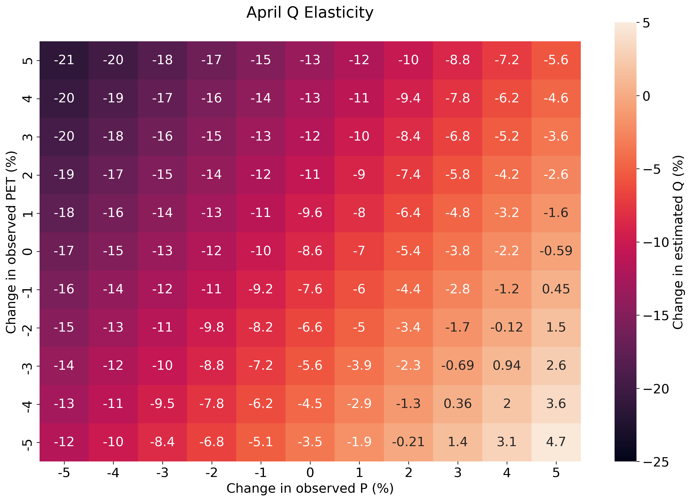
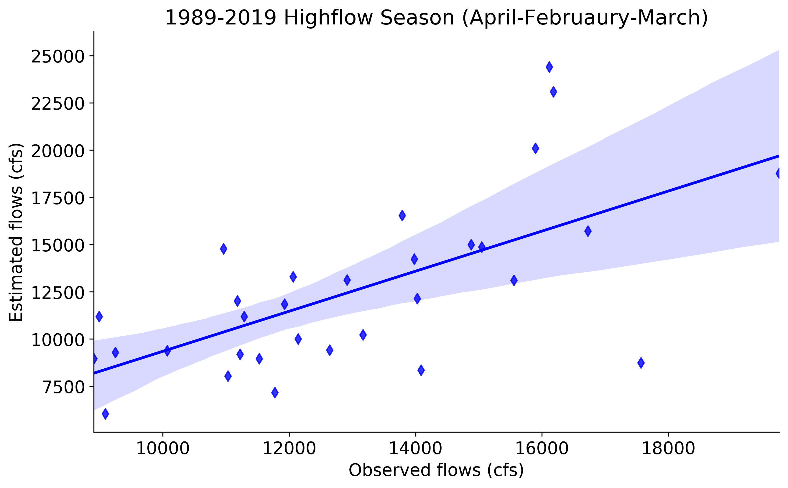
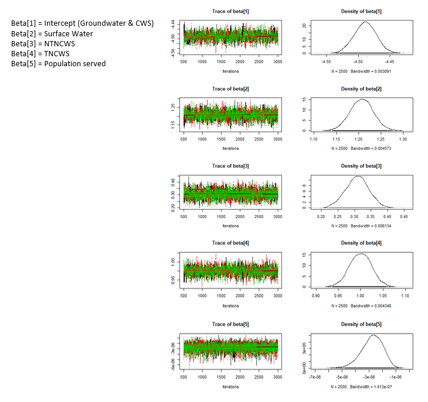
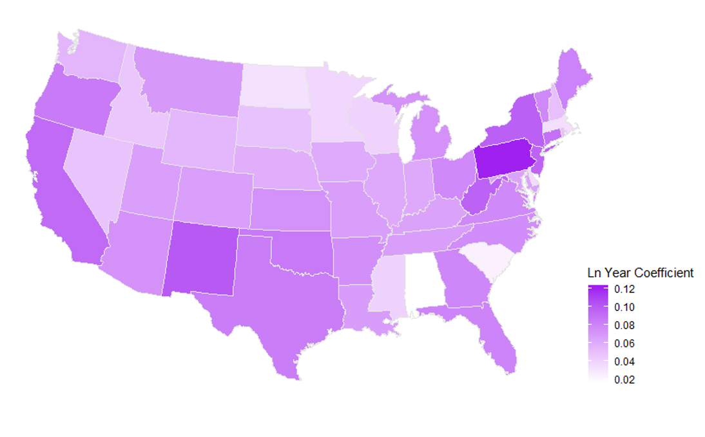
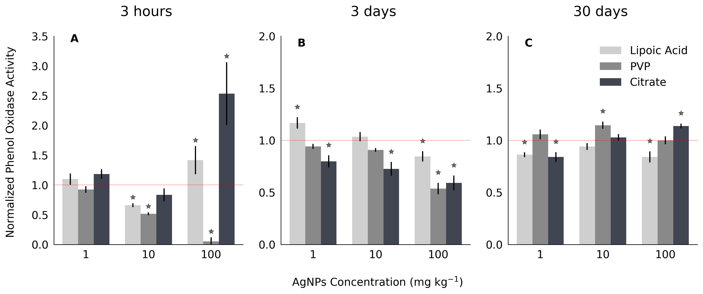
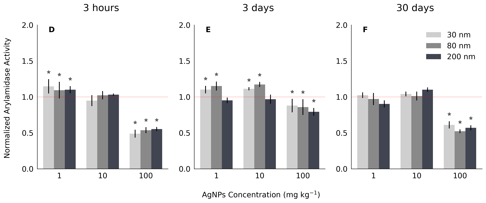
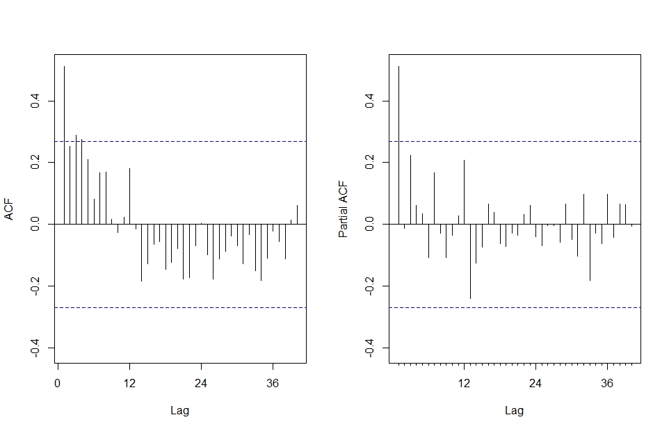
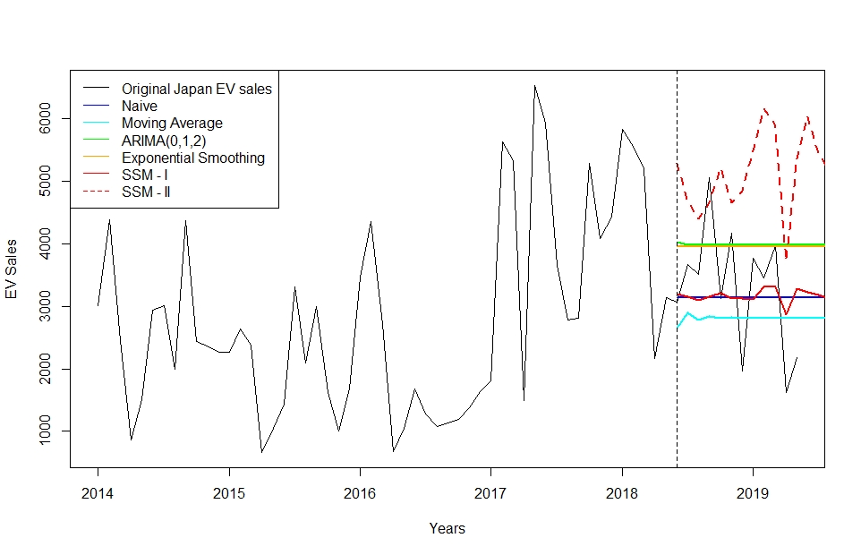

## Watershed & Stream Delineation Tool
#### Automation of geospatial workflow | Python, ArcGIS Pro, ArcPy | [Link](https://github.com/PierreMishra/Watershed-Stream-Delineation-Tool)
This tool,
* Delineates watersheds and streams using Digital Elevation Model (DEM) raster(s) and outlet point(s) provided as an input in ArcGIS Pro
* Allows two ways to input outlet point(s); 1) user can load their own shapefile containing point feature(s) or 2) user can select point(s) on any base map (for reference) using the pencil tool next to drop down button
* Combines rasters and projects them to a uniform spatial reference if multiple DEM(s) are provided by the user
* Provides progress status in realtime when the tool is running

 

 

## Water Budget Navigator (in progress)
#### Web app development | R Shiny, JavaScript, HTML, CSS, SPARQL | [Link](https://internetofwater.shinyapps.io/WaterBudgetNavigator/) 
* Develop an interactive tool to visualize the relationships among different components, estimation methods, parameters and data sources of water budget framework across different states
* Query RDF databases of water budget frameworks using SPARQL (Structured Protocol and RDF Query Language) to feed data into the web app
* Wrangle nested JSON file obtained through SPARQL and curate reproducible D3 interactive visualizations in JavaScript
* Output D3.js visualizations by states, components and data sources based on user input using R Shiny and HTML
* Dynamically summarize flow information and inter-state relationship of each component 
* Link each water budget term in the dynamic output to its unique resource identifier via hyperlink
* Stylize the webapp using JavaScript and CSS

       

## Climate Diagnostics and Probablistic Streamflow Forecasts
#### K-Nearest Neighbours (KNN), autoregressive analysis, watershed models, model evaluation, flow duration curves | Python, ArcGIS
* Applied lumped watershed and SWAT models to forecast streamflow
* Developed regression models to forecast the seasonal mean flow for the peak flow and low seasons by using Nino3.4 and the observed flow in the previous season as predictors
* Obtained flow duration curves and probabilistic streamflow forecasts using AR(1) model and KNN model with Mahalanobis Distance
* Performed model calibration and validation and evaluated model performances
* Generated climate elasticity heatmaps for monthly flow forecasts

   

 

## US Dam Safety & Runoff Trends
#### Ordinal logistic regression, trend analysis, geospatial analysis | R | [Link](https://github.com/PierreMishra/US_Dam_Safety_ENV.872)
* Explored physical features for 90,000 dams that can predict dam safety using National Inventory of Dams dataset by US Army Corps
* Performed ordinal logistic regression on logged predictor variables to determine the effects of the structure of a dam on its classified safety hazard
* Investigated the stream discharge trends in North Carolina (NC) to find whether increasing runoff trends pose a threat to dam structures
* Performed montonic trend analysis to determine the annual run-off trends in hydrologic unit 8 (HUC-8) sub basins of NC using USGS Waterwatch dataset
* Layered the dams and run-off analysis as feature layers within NC boundary to observe the spatial distribution of dams with varying risks, in sub basins with increasing or decreasing run-off trends.

   

       

## Analyzing US Safe Drinking Water Act (SDWA) Violations since 1988
#### Bayesian inference, logistic regression, poisson regression | R | [Link](https://github.com/PierreMishra/Safe_Drinking_Water_Act_Violations_ENV.665)
* Used Bayesian statisitics to study factors associated to over 3 million SDWA violations and frequency of such violations in 50 states
* Performed logsitic regression using a logit link function to investigate the effects on acute health-based violations by public water system type, number of population served by the water system and the source of water supply
* Performed poisson regresson using a log link function to analyze the temporal effect on frequency of acute-health based violations across states.
* Mapped the results of poisson regression to compare SDWA violations trend among states

   

<iframe width="100%" height="300" frameborder="0" scrolling="no" src="//plotly.com/~prashankpm/1.embed"></iframe>

       

## Effect of silver nanoparticles on soil enzymes (Published in 2020)
#### Data visualization, ANOVA | Python
* Conducted laboratory assays of soil enzymes on over 200 samples at different times intervals to study the impact of nanoparticles of varying concentrations, sizes and coatings
* Interpreted 180 page results of multilevel ANOVA models generated using SAS on laboratory data   
* Reshaped laboratory data and visualized significant results in Python
* Research was published in Geoderma journal. It is available <a href="https://www.sciencedirect.com/science/article/pii/S0016706120314518?dgcid=author" target="_blank"> online </a> on Elsevier's ScienceDirect platform.

   

       

## Global Lung Cancer Rates
#### Multiple Linear Regression | R | [Link](https://github.com/PierreMishra/Lung_Cancer_Rates_ENV.710)
* Explored environmental and socio-economic variables of 152 nations from 6 separate CSVs to analyze their effects on lung cancer rates.
* Implemented ordinary least square (OLS) method to estimate the parameters of multiple linear regression models.
* Developed three OLS models for all nations, high-income nations (with GDP per capita > $15,000) and low-income nations (with GDP per capita < $15,000)

  
  

       

## Electric Vehicle Sales Forecasting 
#### Time-Series Analysis | R | [Link](https://github.com/PierreMishra/EV_Sales_Forecasting_ENV.790)
* Used time series forecasting to analyze national targets of electric vehicle sales of the major global EV players, China, Japan and France
* Employed various forecasting models such as state-space models, ARIMA, exponential smoothing etc. to assess their applicability in long-term predictions

  
  

